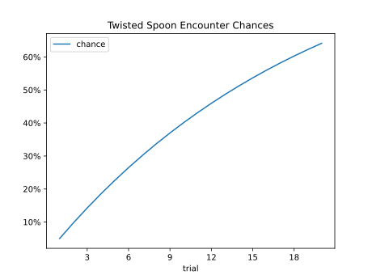
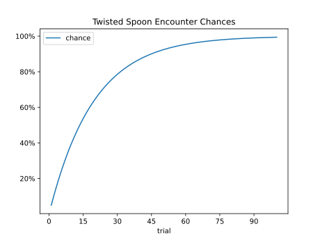

# Twisted Spoon

## Problem Description

While playing through 
[Leaf Green](https://www.nintendo.com/us/store/products/english-pokemon-leafgreen-version-switch/?srsltid=AfmBOopiaD3s87JT8MZX7ipjds0GhlEMxhFePcE7afdDdtfx9XZbFFKZ)
recently, I was training an [Alakazam](https://pokemondb.net/pokedex/alakazam)
and realized there's an item called [Twisted Spoon](https://pokemondb.net/item/twisted-spoon),
which boosts the damage Alakazam can do.
This item is obtained by finding [Abra](https://pokemondb.net/pokedex/abra) in the wild, 
which has a 1 in 20 chance of holding this item.

So I decided to write a script using markov chains to give me
and idea of when I would find a twisted spoon.

## Script

The [script](./script.js) makes a markov state distribution / transition matrix.

State 0 denotes not having the spoon.

State 1 denote finding a spoon

## Plots

Here's a plot of the chances of finding the spoon within the first 20 attempts

Here's a plot of the chances of finding the spoon within the first 20 attempts

